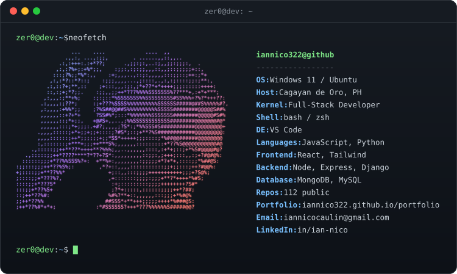

<p align="center">
  
</p>

<p align="center">
  <a href="https://iannico322.github.io/portfolio"></a>
  <a href="https://www.linkedin.com/in/ian-nico/"></a>
  <a href="mailto:iannicocaulin@gmail.com"></a>
  
</p>


## `~/` whoami

> I'm a full-stack developer from **Cagayan de Oro, Philippines**.
> I work mostly in the **MERN stack** for web apps, and reach for **Python**
> when the problem is closer to data, automation, or a quick backend.
>
> Most of what's here started as something I wanted to see working.
> Some of it is polished, some of it is me learning in public — I've kept
> both, because the messy repos are usually where the learning happened.

<table>
<tr>
<td valign="top" width="50%">

**⚡ Right now**

- 🔭 Building **[DICT KMS](https://edtr10.github.io/kms)**
- 🌱 Learning **Machine Learning, Cyber Security and Web Development**
- 🧩 Open to collaborating on side projects

</td>
<td valign="top" width="50%">

**🗒️ Good to know**

- 📍 Cagayan de Oro, Philippines
- 🎮 Online I go by **Zer0**
- 💬 Ask me about **React, Node, Python**

</td>
</tr>
</table>

<details>
<summary><b><code>$ cat portrait.txt</code></b></summary>

<br>

```
                                  -
                        -:::::-----::::--:--
                    -::::::::-------:::::------
                  -:::::::::-::::::::-:------=---
                 :::::::::::::::---=--==-=--===----
               :::::::::::::-::------::::------:-----
              :::::::::::--:::::::::::::::::-=--:::---=
             :::::::::::::::::::---====--:-::-:-:::---=-
             :::::::::::::-===+***####**+++===-:::--------
           -::::::::::::-=++++**####%%%%%####*+=-:::--::::-
            :::::::::::-==++++**###%%%%%%%%%%%%#+=-:--:-:--
            :::::::::---==++++**##%%%%%%%@@@%%%##+=-:::--=-
            :::::::::--==+++**#######%%%@@@@@@%%#*++=-::-:-
            :::::::::--===+**#######%%%%%%%%%%%%%#*+++-:::
            :::::::::::::::--=+**#**++------++*##%%#+==-::
            ::::::::::::--:::::-+##+======+*+++**#%%#+=-::
            ::::::::::::--++-:::*%@%#*-----+***###%%%*=---
            ::::::::::::::=*-::+#%@@@#+-=--+++#%%%%%%*=--
             ::::::----====--:=*%@@@@@@%####%@@@@@%%%#===++
            -::::::-+****+=---=#@@@@@@@@@@@@@@@@@@%%%#=#@@#*
            :::::::-=++++=:::::-*#++#%%%%@@@@@@@@@%%##+%%@@#
            ::::::::-==+=::::--++####%%@%%@@@@@@@%%##*##+%@%
            :::::::::-------==+****#%%@@@@@@@@@@%%###*%@##@*
             :::::::::-::::::-==+++*+++*##%@@@@%%%###%@@@@#
              :::::::::::::::-=***#%%###%%%@@%%%%###*#@%%
               -:-::::::::::::---=+#%%@@@@%%%%%%##**=
                   ::::::::-==+**##%%@@@@@%%%%##****
                     ::::::--=+***#%@@@%%%%###*++*##
                      ::::::::-===+****##**++++*#%%*
                      -::::::::::::----====+*#%%%%%*
                       :::::::::::::--==+**#%%%@@%*=
                       ::::::::::-=++*###%%%%@@%*===-
                       ::::::::-++**#%%%%%%%%#+=====
                        :::::::-=++*#%%%%%%*+======
                       -:::::::-=+*##%%%%*=======-
                      ::::::::-=+**####+=======+-
                     ::::::::::-++***+=-=+====+-
                       :::::::::-----:-=+=====-
                        :::::::::--      ====
```

</details>


## `~/` stack

<table>
<tr>
<td valign="middle"><b>Languages</b></td>
<td></td>
</tr>
<tr>
<td valign="middle"><b>Frontend</b></td>
<td></td>
</tr>
<tr>
<td valign="middle"><b>Backend</b></td>
<td></td>
</tr>
<tr>
<td valign="middle"><b>Data &amp; Tools</b></td>
<td></td>
</tr>
</table>


## `~/` MyPortfolio

<table>
<tr>
<td width="50%" valign="top">

### 🌐 [Portfolio](https://iannico322.github.io/portfolio)

My personal site — background, projects, and contact in one place.

`JJK THEME`

</td>

</tr>
</table>

<p align="center">
  <a href="https://github.com/iannico322?tab=repositories">
    
  </a>
</p>


## `~/` connect

<p align="center">
  <a href="mailto:iannicocaulin@gmail.com"></a>
  &nbsp;
  <a href="https://www.linkedin.com/in/ian-nico/"></a>
  &nbsp;
  <a href="https://iannico322.github.io/portfolio"></a>
</p>


<p align="center">
  <sub><code>zer0@dev:~$ exit</code></sub>
</p>
